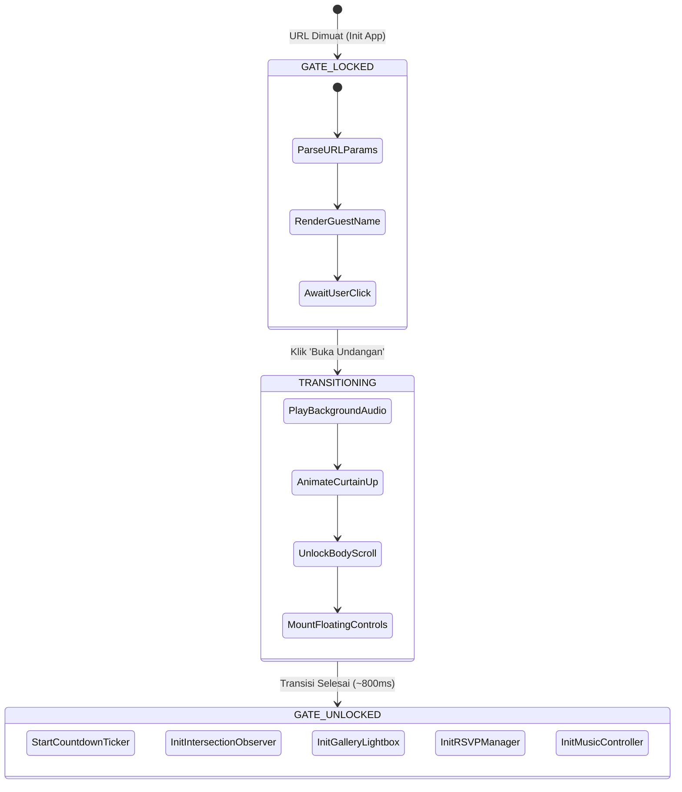
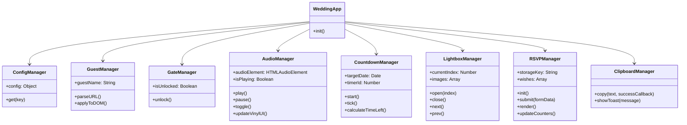

# System Architecture & Technical Specification
## Template Undangan Pernikahan Digital (Client Prototype)

> **Dokumen Arsitektur Perangkat Lunak** — Panduan teknis komprehensif mengenai struktur sistem, aliran data (*data flow*), manajemen *state*, siklus hidup aplikasi (*lifecycle*), dan arsitektur kode untuk template undangan pernikahan digital berbasis Vanilla Web Stack.

---

## 1. Ikhtisar Sistem & Prinsip Rekayasa (Engineering Principles)

Website ini dirancang sebagai aplikasi web berbasis klien (*client-side web app*) dengan spesifikasi kinerja tinggi, keandalan maksimal, dan kemudahan penerapan untuk calon klien.

### Prinsip Utama:
1. **Zero-Dependency & Zero-Build Runtime**
   - Dibangun murni menggunakan **HTML5 semantik**, **Vanilla CSS3**, dan **Modern Vanilla ES6+ JavaScript**.
   - Tidak memerlukan *build tools* (Webpack/Vite/Babel) untuk dijalankan — berkas dapat langsung dibuka di browser lokal (`file://`) atau di-hosting di server statis mana pun (Vercel, Netlify, GitHub Pages, cPanel/Apache, Nginx).
2. **Mobile-First Responsive Container Architecture**
   - Dirancang khusus dengan pendekatan *mobile-first*: di layar smartphone tampil *full-width* alami, sementara di layar tablet dan desktop dibungkus dalam *app container* elegan dengan latar belakang atmosferik bertekstur, memberikan kesan aplikasi mobile premium.
3. **Browser Autoplay Policy Compliance**
   - Audio latar tidak dipaksa menyala saat halaman pertama kali dimuat (menghindari pemblokiran browser modern). Pemutaran lagu dikaitkan langsung dengan *user gesture* eksplisit pada tombol *"Buka Undangan"*.
4. **Data Sanitization & XSS Prevention**
   - Input ucapan dan nama dari buku tamu disanitasi secara ketat sebelum dimasukkan ke dalam DOM untuk mencegah serangan *Cross-Site Scripting* (XSS).
5. **Persistensi Data Lokal (Local Persistence)**
   - Menggunakan `localStorage` terstruktur untuk menyimpan ucapan tamu dan konfirmasi kehadiran, sehingga data simulasi klien tetap bertahan saat halaman dimuat ulang.

---

## 2. Struktur Direktori & Tanggung Jawab Modul

```
d:\coding\design website pernikahan\
│
├── index.html                  # Dokumen utama: struktur semantik 12 sections & meta tags
├── design.md                   # Spesifikasi visual, tipografi, dan token desain
├── architecture.md             # Spesifikasi arsitektur teknis dan logika sistem
│
├── assets/
│   ├── css/
│   │   └── style.css           # Design tokens, reset, layout, animasi, komponen UI
│   │
│   ├── js/
│   │   ├── config.js           # Konfigurasi data mempelai, tanggal, rekening, kontak
│   │   └── app.js              # Controller utama: event handling, DOM logic, managers
│   │
│   ├── img/
│   │   ├── template/           # Aset fotografi pernikahan bertaraf editorial (WebP)
│   │   │   ├── cover.webp      # Foto latar cover gatekeeper
│   │   │   ├── hero.webp       # Foto header pasangan utama
│   │   │   ├── bride.webp      # Foto potret mempelai wanita
│   │   │   ├── groom.webp      # Foto potret mempelai pria
│   │   │   ├── story.webp      # Foto pelengkap kisah cinta
│   │   │   ├── closing.webp    # Foto penutup ucapan terima kasih
│   │   │   └── gallery/        # 10 foto pre-wedding resolusi tinggi
│   │   │       ├── g1.webp s.d g10.webp
│   │   │
│   │   └── icons/              # Ikon vektor SVG tajam
│   │       ├── bank-bca.svg    # Logo resmi Bank BCA
│   │       ├── bank-mandiri.svg# Logo resmi Bank Mandiri
│   │       ├── bank-bsi.svg    # Logo resmi Bank Syariah Indonesia
│   │       ├── ewallet-dana.svg# Logo resmi DANA
│   │       └── chip-atm.svg    # Ornamen chip kartu debit emas
│   │
│   └── audio/
│       └── akad-payung-teduh.mp3 # Audio lagu pengiring: Akad - Payung Teduh
```

---

## 3. Diagram Aliran Data & Siklus Hidup (Application Lifecycle)



### Detail Status Aplikasi:

1. **Status `GATE_LOCKED` (Kondisi Awal)**
   - Body diberi kelas `.gate-locked` dengan aturan CSS `overflow: hidden; height: 100vh;`.
   - Konten cover dirender di lapisan paling atas (`z-index: 1000`).
   - JavaScript mengekstrak parameter URL `?to=` melalui `URLSearchParams`. Jika ada, teks *"Nama Tamu"* langsung diinjeksi ke cover dan disimpan ke memori untuk form RSVP.
   - Audio berstatus `PAUSED`. Kontrol musik melayang dan navigasi bawah dalam kondisi tersembunyi (`opacity: 0; pointer-events: none`).

2. **Status `TRANSITIONING` (Pemicu Interaksi)**
   - Tamu menekan tombol *"Buka Undangan"*.
   - Objek `Audio` memanggil `.play()` (memenuhi syarat *User Activation* peramban).
   - Lapisan cover menerima kelas `.gate-opened` yang memicu animasi *curtain slide-up* dengan akselerasi GPU `transform: translateY(-100%); transition: transform 0.85s cubic-bezier(0.77, 0, 0.175, 1)`.
   - Kelas `.gate-locked` pada `<body>` dicabut sehingga fungsi scroll halaman aktif.

3. **Status `GATE_UNLOCKED` (Halaman Aktif)**
   - Elemen melayang (*Floating Music Controller* & *Navigation Dock*) memudar masuk (*fade-in*).
   - Ticker countdown berjalan dengan interval `1000ms`.
   - Observer scroll aktif untuk menganimasikan elemen yang masuk ke *viewport*.

---

## 4. Arsitektur Komponen JavaScript Modular

Untuk memudahkan pemeliharaan dan kustomisasi oleh klien, JavaScript dipecah ke dalam modul objek (*object namespaces*) yang terisolasi di dalam `app.js`:



### Rincian Tanggung Jawab Komponen:

#### A. `ConfigManager` (`assets/js/config.js`)
Pusat konfigurasi tunggal (*single source of truth*) yang memisahkan data bisnis dari kode logika. Calon klien cukup mengedit berkas ini untuk mengganti:
- Nama panggilan & nama lengkap mempelai
- Data orang tua masing-masing mempelai
- Tanggal & waktu Akad Nikah dan Resepsi
- Koordinat/link Google Maps lokasi
- Nomor rekening & nama pemilik rekening (BCA, Mandiri, BSI, DANA)
- Alamat pengiriman kado fisik
- Tanggal target hitung mundur (*countdown target*)

#### B. `GuestManager`
- Membaca URL `window.location.search`.
- Mengurai parameter `to` atau `nama` (contoh: `?to=Bapak+Hartono+%26+Ibu`).
- Membersihkan input dari karakter berbahaya (*HTML entity escaping*).
- Menampilkan nama di Cover secara dinamis dan mengisi otomatis kolom nama pada formulir RSVP.

#### C. `GateManager`
- Mengatur transisi buka undangan.
- Mengontrol status kunci gulir (*scroll lock*) pada elemen `<body>` dan `<html>`.
- Mengaktifkan bilah navigasi melayang (*floating nav*) setelah gerbang terbuka.

#### D. `AudioManager`
- Mengelola pemutaran lagu latar menggunakan antarmuka `HTMLAudioElement`.
- Menyinkronkan status pemutaran (`playing` vs `paused`) dengan animasi piringan hitam melayang:
  - Berputar saat aktif (`animation-play-state: running`).
  - Berhenti saat dijeda (`animation-play-state: paused`).
- Menyediakan penanganan kesalahan (*error handling*) apabila browser menerapkan pembatasan audio.

#### E. `CountdownManager`
- Menghitung selisih waktu antara waktu sekarang (`new Date().getTime()`) dengan tanggal pernikahan target.
- Memperbarui 4 elemen DOM (`#days`, `#hours`, `#minutes`, `#seconds`) setiap detik.
- Menambahkan angka nol di depan (*zero padding*) untuk nilai di bawah 10 (`09`, `08`, dst).
- Menampilkan status *"Acara Sedang Berlangsung"* atau *"Telah Selesai"* jika waktu target telah terlewati.

#### F. `LightboxManager`
- Menangkap klik pada semua kartu galeri foto (`.gallery-item`).
- Menampilkan modal fullscreen dengan foto resolusi tinggi.
- Mengelola indeks foto aktif (`currentIndex`), tombol panah kiri/kanan, dan tombol keluar (`Esc`).
- Mendukung *gesture swipe* sentuhan pada perangkat mobile (`touchstart`, `touchend`).

#### G. `RSVPManager`
- Mengambil data ucapan yang tersimpan dari `localStorage` dengan kunci unik `WEDDING_TEMPLATE_RSVP_V1`.
- Jika `localStorage` masih kosong, memuat data ucapan bawaan (*starter seed wishes*) yang realistis agar prototipe tampak hidup di depan klien.
- Menghitung metrik kehadiran: Total Ucapan, Total Hadir, Total Tidak Hadir.
- Menangani formulir pengiriman ucapan:
  - Validasi kolom nama & pesan tidak boleh kosong.
  - Menambahkan ucapan baru ke posisi paling atas daftar ucapan (*prepend*).
  - Menyimpan kembali array data terbaru ke `localStorage`.

#### H. `ClipboardManager`
- Mengimplementasikan `navigator.clipboard.writeText(text)` untuk menyalin nomor rekening atau alamat pengiriman.
- Memiliki mekanisme *fallback* ke `document.execCommand('copy')` untuk peramban lawas.
- Memunculkan komponen Toast notifikasi melayang dengan animasi halus selama 2.5 detik.

---

## 5. Arsitektur CSS & Sistem Desain (Styling Architecture)

Mengikuti arsitektur CSS modular berbasis variabel dan komponen:

```
style.css
│
├── 1. CSS Reset & Base Defaults
├── 2. Design Tokens (:root CSS Custom Properties)
│      ├── Colors (Theme Palettes)
│      ├── Typography (Font families, sizes, weights)
│      ├── Shadows & Elevation
│      └── Transitions & Curves
│
├── 3. App Shell & Layout Engine
│      ├── .desktop-backdrop (Latar atmosferik layar lebar)
│      ├── .app-container (Max-width 480px untuk nuansa mobile app)
│      └── .main-wrapper
│
├── 4. Keyframe Animations
│      ├── @keyframes curtainUp
│      ├── @keyframes spinVinyl
│      ├── @keyframes pulseGlow
│      ├── @keyframes floatSoft
│      └── @keyframes fadeInUp
│
├── 5. Section Components
│      ├── .section-cover (Pintu masuk fullscreen)
│      ├── .section-hero (Header nama & tanggal)
│      ├── .section-quote (Kutipan ayat suci)
│      ├── .section-couple (Profil mempelai wanita & pria)
│      ├── .section-countdown (Kotak waktu mundur)
│      ├── .section-events (Kartu akad & resepsi)
│      ├── .section-gallery (Grid & hover states)
│      ├── .section-story (Timeline naratif bergaris)
│      ├── .section-gifts (Kartu ATM digital & alamat kado)
│      ├── .section-rsvp (Formulir buku tamu & ucapan)
│      ├── .section-closing (Penutup & tanda tangan)
│      └── .section-footer (Kredit & sosial media)
│
├── 6. Floating Interfaces
│      ├── .floating-music-disc (Piringan hitam pemutar lagu)
│      ├── .floating-nav-dock (Bilah navigasi cepat di bawah)
│      └── .toast-notification (Alert pop-up salin rekening)
│
└── 7. Modal & Lightbox Styles
       └── .lightbox-modal (Penampil foto layar penuh)
```

---

## 6. Penanganan Keamanan & Aksesibilitas (Security & A11y)

1. **Pencegahan XSS (Cross-Site Scripting)**
   Setiap pesan doa dan nama tamu yang dimasukkan ke form di-escape sebelum dimasukkan ke DOM melalui fungsi:
   ```javascript
   function escapeHTML(str) {
       return str.replace(/[&<>'"]/g, 
           tag => ({ '&': '&amp;', '<': '&lt;', '>': '&gt;', "'": '&#39;', '"': '&quot;' }[tag] || tag)
       );
   }
   ```
2. **Aksesibilitas Kontras & Warna (WCAG Compliance)**
   - Rasio kontras teks utama (`#332720`) di atas latar ivory (`#F9FAF7`) mencapai > `10.5:1` (melampaui standar WCAG AAA 7:1).
   - Tombol interaktif memiliki ukuran sentuh (*touch target*) minimal `44px x 44px` sesuai standar antarmuka seluler Apple HIG dan Google Material Design.
3. **Optimasi Kinerja (Core Web Vitals)**
   - Gambar menggunakan atribut `loading="lazy"` pada section di bawah lipatan layar (*below-the-fold*).
   - Animasi hanya menggunakan properti `transform` dan `opacity` yang diakselerasi langsung oleh unit pemrosesan grafis (GPU compositing), menghindari *reflow* atau *layout thrashing*.

---

## 7. Panduan Penerapan untuk Klien (Deployment Architecture)

Template ini dapat di-deploy ke berbagai platform dalam waktu kurang dari 1 menit:

| Platform | Metode Deploy | Biaya |
| :--- | :--- | :--- |
| **Vercel** | Tarik folder / git repo -> Deploy otomatis | Gratis |
| **Netlify** | Drag-and-drop folder ke dashboard | Gratis |
| **GitHub Pages** | Push ke branch `main` / `gh-pages` | Gratis |
| **cPanel / Hosting Tradisional** | Upload berkas zip ke `public_html/` | Termasuk di paket hosting klien |

### Format Pembuatan Link Undangan Tamu:
```
https://nama-domain.com/?to=Nama+Tamu+Yang+Diundang
```
Contoh integrasi pesan WhatsApp otomatis:
> *"Kepada Yth. Bapak Budi Santoso & Keluarga, kami mengundang kehadiran Bapak/Ibu pada pernikahan kami melalui tautan berikut: https://wedding.domain.com/?to=Bapak+Budi+Santoso+%26+Keluarga"*
