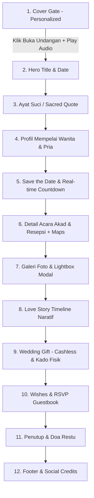

# Design Specification & System Architecture
## Template Undangan Pernikahan Digital (Client Prototype)

> **Dokumen Desain Resmi** — Panduan arsitektur visual, sistem desain, komponen antarmuka, dan interaktivitas untuk template prototipe undangan pernikahan digital bertaraf profesional.

---

## 1. Filosofi & Konsep Desain

Konsep visual mengusung tema **"Warm Modern Luxury & Botanical Romance"**:
- **Kesan Pertama Memukau**: Pintu masuk bergaya gerbang (*Curtain Gate Cover*) yang memberikan pengalaman personal kepada setiap tamu undangan.
- **Elegan & Lembut**: Menghindari warna hitam pekat (`#000`) dan warna jenuh yang tajam; beralih ke gradasi *ivory cream*, *deep espresso brown*, *sage olive green*, dan *champagne gold*.
- **Mobile-First Experience**: Mengingat >90% tamu membuka undangan dari smartphone, rancangan mengutamakan tata letak mobile dengan pembungkus (*container*) responsif yang tetap terlihat mewah di layar tablet dan desktop berkat latar atmosferik yang estetik.
- **Kaya Interaksi Halus (*Micro-Animations*)**: Scroll reveal, piringan musik berputar, tombol toast salin nomor rekening, modal lightbox foto, dan counter waktu nyata.

---

## 2. Sistem Warna (Color Palette & Tokens)

| Token CSS | Kode Hex | Peran & Penggunaan |
| :--- | :--- | :--- |
| `--color-bg-main` | `#F9FAF7` | Latar belakang halaman utama (lembut, tidak silau) |
| `--color-bg-card` | `#FFFFFF` | Latar belakang kartu konten dan modal dialog |
| `--color-bg-soft` | `#F3F4EE` | Latar belakang sekunder / aksen kartu kutipan |
| `--color-text-main` | `#332720` | Teks utama, judul, dan nama mempelai (espresso hangat) |
| `--color-text-muted` | `#6C625B` | Teks keterangan, paragraf, dan sub-judul |
| `--color-text-light` | `#968E87` | Teks label tanggal, copyright, dan placeholder |
| `--color-sage-primary` | `#7D8B6F` | Warna aksen utama (sage olive green: tombol, badge, garis) |
| `--color-sage-dark` | `#5F6C52` | Status hover tombol primer & ikon aktif |
| `--color-sage-light` | `#E8ECE1` | Badge status hadir, tag tahun cerita, sorotan |
| `--color-gold-accent` | `#C79D4C` | Aksen mewah: ornamen, chip ATM, bintang pembatas |
| `--color-gold-hover` | `#A88035` | Hover aksen emas |
| `--color-border` | `rgba(125, 139, 111, 0.22)` | Garis tepi kartu dan pembatas tipis |
| `--color-shadow` | `rgba(51, 39, 32, 0.08)` | Bayangan kartu halus (soft elevation) |

---

## 3. Tipografi (Typography Hierarchy)

Menggunakan kombinasi Google Fonts yang harmonis, formal, dan mudah dibaca:

1. **Heading & Nama Pasangan**: `'Cormorant Garamond'`, serif
   - Bobot: 400 (Regular), 600 (Semi-Bold), 700 (Bold)
   - Karakter: Anggun, klasik, editorial majalah pernikahan berkelas.
2. **Kaligrafi Aksen**: `'Pinyon Script'`, cursive
   - Bobot: 400
   - Karakter: Digunakan untuk kata sambung *"The Wedding of"*, *"and"*, serta inisial monogram.
3. **Teks Utama & Antarmuka (Body & UI)**: `'Montserrat'`, sans-serif
   - Bobot: 300 (Light), 400 (Regular), 500 (Medium), 600 (Semi-Bold)
   - Karakter: Sangat bersih, modern, dan nyaman dibaca di layar smartphone berbagai ukuran.

```css
/* Skala Tipografi */
--font-title-hero: clamp(2.4rem, 6vw, 3.5rem);
--font-title-section: clamp(1.8rem, 4vw, 2.4rem);
--font-title-card: 1.35rem;
--font-script-accent: clamp(2rem, 5vw, 3rem);
--font-body-regular: 0.95rem;
--font-body-small: 0.85rem;
--font-body-tiny: 0.75rem;
```

---

## 4. Alur & Struktur Halaman (12 Section Sesuai PRD)



### Rincian Spesifikasi per Section:

### 1. Cover (Gatekeeper / Pintu Masuk)
- **Tampilan**: `100vh` / `100dvh` menutupi seluruh layar pertama kali dibuka.
- **Latar**: Foto pre-wedding estetik dengan *vignette* gelap halus (`linear-gradient(rgba(0,0,0,0.35), rgba(0,0,0,0.65))`).
- **Komponen**:
  - Monogram inisial pasangan dalam bingkai lingkaran emas.
  - Sapaan tamu personal dinamis: *"Kepada Yth. Bapak/Ibu/Saudara/i:"* dilanjutkan nama tamu besar (otomatis diambil dari query parameter URL `?to=Nama+Tamu`).
  - Tombol aksi utama: *"Buka Undangan"* berbingkai emas dengan ikon amplop berdenyut (*pulse effect*).
- **Interaksi**: Saat tombol diklik:
  - Musik latar otomatis mulai berputar (*autoplay compliance*).
  - Layar cover terangkat/pudar halus ke atas (*slide-up curtain transition*).
  - Tombol musik melayang (*Floating Music Controller*) dan bilah navigasi bawah (*Floating Nav Dock*) muncul.
  - Halaman mengizinkan fungsi scroll.

### 2. Hero Section
- **Tampilan**: Puncak halaman utama dengan foto beresolusi tinggi, ornamen dedaunan/bunga SVG simetris.
- **Teks**: *"THE WEDDING OF"*, nama panggilan kedua mempelai besar bersambung kaligrafi, serta badge tanggal pernikahan lengkap.

### 3. Ayat Suci (Quote Block)
- **Tampilan**: Kartu bertekstur kertas lembut (*parchment card*) dengan bayangan halus.
- **Konten**: Kutipan ayat suci QS. Ar-Rum (30) : 21 (atau teks mutiara cinta universal untuk fleksibilitas klien). Teks dicetak miring dengan tanda kutip emas dan keterangan surat di bagian bawah.

### 4. Bride & Groom (Profil Pasangan)
- **Tata Letak**: 2 kolom sejajar di desktop/tablet; tumpukan vertikal di mobile.
- **Kartu Mempelai Wanita**:
  - Foto potret bulat berbingkai garis ganda emas-sage.
  - Nama lengkap & gelar formal.
  - Keterangan putri dari orang tua.
  - Tautan tombol Instagram profil.
- **Ornamen Penghubung**: Monogram tanda `&` berornamen bunga di antara kedua profil.
- **Kartu Mempelai Pria**:
  - Foto potret bulat dengan bingkai serupa.
  - Nama lengkap & gelar formal.
  - Keterangan putra dari orang tua.
  - Tautan tombol Instagram profil.

### 5. Save the Date (Hitung Mundur Waktu Nyata)
- **Pesan Sambutan**: *"Tanpa mengurangi rasa hormat, kami mengundang Bapak/Ibu/Saudara/i..."*
- **Grid Countdown**: 4 kotak angka (Hari, Jam, Menit, Detik) bergaya kaca halus (*glassmorphism*) dengan angka tebal dan label di bawahnya.
- **Pembaruan**: Diperbarui setiap detik secara mulus dengan JavaScript `setInterval`.
- **Fitur Tambahan**: Tombol interaktif *"Simpan ke Google Calendar"* & download event calendar `.ics`.

### 6. Detail Acara (Akad Nikah & Resepsi)
- **Struktur**: 2 kartu terpisah yang tegas dan rapi.
- **Kartu 1 - Akad Nikah**:
  - Tanggal: Sabtu, 20 Desember 2025
  - Waktu: 09.00 WIB s.d Selesai
  - Tempat: Kediaman Mempelai Wanita / Lokasi Ibadah
  - Tombol: *"Buka Google Maps"* (ikon peta, tautan `_blank`).
- **Pembatas**: Ornamen floral SVG elegan di antara kedua acara.
- **Kartu 2 - Resepsi Pernikahan**:
  - Tanggal: Minggu, 21 Desember 2025
  - Waktu: 11.00 WIB s.d Selesai
  - Tempat: Hadrah Wedding Garden / Ballroom Hotel
  - Tombol: *"Buka Google Maps"*.

### 7. Galeri Foto & Lightbox Modal
- **Struktur Grid**: Grid responsif (3 kolom desktop, 2 kolom mobile).
- **Koleksi Foto**: 8–12 foto pernikahan estetik (cincin, buket, venue dekorasi, tatapan pasangan, detail busana).
- **Interaksi Grid**: Efek *scale-up* halus saat hover dengan ikon kaca pembesar / hati.
- **Modal Lightbox Fullscreen**:
  - Membuka foto resolusi penuh saat thumbnail diklik.
  - Navigasi tombol Panah Kiri (Sebelumnya), Panah Kanan (Selanjutnya), dan Tombol Tutup (`X`).
  - Indikator posisi foto (contoh: `Foto 3 dari 10`).
  - Dukungan navigasi keyboard: `ArrowLeft`, `ArrowRight`, dan `Escape`.
  - Dukungan swipe kiri/kanan pada layar sentuh.

### 8. Love Story (Timeline Naratif)
- **Tata Letak**: Alur waktu vertikal dengan garis pandu putus-putus dan titik simpul (*milestone nodes*).
- **Konten Cerita**:
  - **2020**: *Awal Pertemuan* — Pandangan pertama dan perkenalan singkat yang hangat.
  - **2022**: *Menjalin Cerita* — Menemukan kecocokan prinsip dan melangkah dalam komitmen bersama.
  - **2024**: *Niat Baik & Lamaran* — Pertemuan kedua keluarga besar dan ungkapan janji setia.
  - **2025**: *Menuju Hari Bahagia* — Mengikat janji suci di hadapan Sang Pencipta dan keluarga terkasih.

### 9. Wedding Gift (Kado Digital & Hadiah Fisik)
- **Kartu Rekening Bank Modern**: Desain menyerupai kartu debit fisik premium dengan latar *gradient sage deep* dan ornamen emas chip ATM.
- **Dukungan Bank & E-Wallet**:
  - Bank BCA: Nomor rekening, nama pemilik, tombol salin 1-klik.
  - Bank Mandiri / BSI: Nomor rekening, nama pemilik, tombol salin 1-klik.
  - E-Wallet (DANA / GoPay): Nomor telepon, nama pemilik, tombol salin 1-klik.
- **Umpan Balik Salin**: Klik tombol *"Salin Nomor"* memicu API `navigator.clipboard.writeText()` dan menampilkan pop-up toast hijau lembut *"Nomor rekening berhasil disalin!"*.
- **Kado Fisik**: Kartu khusus berisi nama penerima, kontak, alamat pengiriman kado lengkap, dan tombol salin alamat.

### 10. Wishes & RSVP (Buku Tamu Interaktif)
- **Statistik Kehadiran**: Widget counter angka besar:
  - Total Ucapan
  - Jumlah Hadir (hijau)
  - Jumlah Tidak Hadir (merah bata lembut)
- **Formulir Interaktif**:
  - Input Nama (otomatis terisi nama tamu dari URL `?to=`).
  - Pilihan Radio / Tombol Kehadiran: *"Akan Hadir"* vs *"Berhalangan Hadir"*.
  - Pilihan Jumlah Orang (1, 2, 3 orang).
  - Kotak Pesan & Doa (Textarea).
  - Tombol *"Kirim Ucapan & Konfirmasi"*.
- **Daftar Ucapan Tamu**:
  - Ucapan baru langsung muncul paling atas tanpa perlu me-reload halaman.
  - Dilengkapi badge hijau *"Hadir"* atau merah muda *"Absen"*, nama pengirim, pesan doa, dan waktu pengiriman (*timestamp*).
  - Data tersimpan otomatis di `localStorage` peramban sehingga tidak hilang saat halaman di-refresh.

### 11. Penutup
- Foto penutup puitis dengan ekspresi bahagia kedua mempelai.
- Untaian kata terima kasih tulus dari kedua mempelai dan keluarga besar.
- Tanda tangan digital (*digital calligraphy signature*) nama kedua pasangan.

### 12. Footer
- Identitas pembuat template / agensi digital (misal: *"Crafted with ❤️ by Your Agency"*).
- Tautan sosial media WhatsApp dan Instagram.

### 13. Fitur Melayang (Floating Interfaces)
- **Floating Music Controller**:
  - Terletak di sudut kiri/kanan bawah layar.
  - Berbentuk piringan hitam (*vinyl disc*) dengan piringan berputar saat lagu berbunyi dan berhenti saat di-pause.
  - Dilengkapi ikon equalizer/gelombang suara animasi.
  - Klik untuk memutar / menjeda lagu kapan saja.
- **Floating Navigation Dock**:
  - Menu melayang di bagian bawah dengan ikon minimalis: Sampul, Pasangan, Acara, Galeri, Kisah, Hadiah, dan Buku Tamu.
  - Membantu tamu melompat langsung ke bagian yang diinginkan dengan *smooth scroll*.

---

## 5. Parameter URL Dinamis untuk Klien

Template mendukung kustomisasi instan untuk setiap nama tamu yang dikirimi link undangan:

```
Format URL:
https://domain-anda.com/undangan/?to=Nama+Tamu

Contoh Penggunaan:
1. https://domain-anda.com/undangan/?to=Bapak+Kurniawan+dan+Keluarga
2. https://domain-anda.com/undangan/?to=Sahabat+Dinda+Putri
3. https://domain-anda.com/undangan/?to=Dr.+Hendra+Pratama,+Sp.A
```

- Jika parameter `?to=` tidak diisi, teks otomatis beralih ke *default* sopan: `"Bapak / Ibu / Saudara / i"`.
- Nama ini juga langsung otomatis terisi ke dalam formulir RSVP pada bagian nama pengirim!

---

## 6. Struktur Berkas Proyek

```
d:\coding\design website pernikahan\
│
├── index.html                   # Halaman utama dengan 12 section terstruktur rapi
├── design.md                    # Dokumentasi spesifikasi desain lengkap ini
├── assets/
│   ├── css/
│   │   └── style.css            # Styling Vanilla CSS murni, design tokens, animasi
│   ├── js/
│   │   └── app.js               # Seluruh logika interaktif, audio, countdown, RSVP, modal
│   ├── img/
│   │   ├── template/            # Foto pernikahan estetik bebas royalti (WebP)
│   │   │   ├── cover.webp
│   │   │   ├── hero.webp
│   │   │   ├── bride.webp
│   │   │   ├── groom.webp
│   │   │   ├── story.webp
│   │   │   ├── closing.webp
│   │   │   └── gallery-1.webp s.d gallery-10.webp
│   │   └── icons/               # Logo bank SVG vektor tajam (BCA, Mandiri, BSI, DANA)
│   └── audio/
│       └── akad-payung-teduh.m4a # Musik pengiring: Akad - Payung Teduh
```

---

## 7. Standar Kualitas & Performa (Client-Ready Checklist)

- [x] **Zero Dependencies Bloat**: Dibangun murni dengan HTML5, CSS3, dan Vanilla ES6+ tanpa jQuery atau framework berat.
- [x] **Lightweight & Fast Load**: Format gambar WebP modern, lazy-loading pada galeri (`loading="lazy"`).
- [x] **Audio Browser Policy Safe**: Musik hanya diputar setelah interaksi eksplisit pertama (klik tombol buka undangan).
- [x] **Cross-Device Tested**: Tampilan presisi di layar Mobile (360px - 480px), Tablet (768px), dan Desktop (1200px+).
- [x] **Mudah Dimodifikasi**: Seluruh data nama, tanggal, rekening, dan kutipan dikelompokkan dalam blok HTML yang mudah diubah oleh siapapun.
